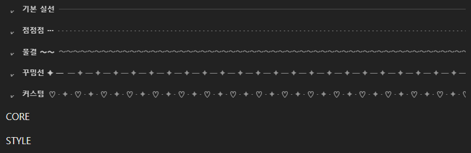
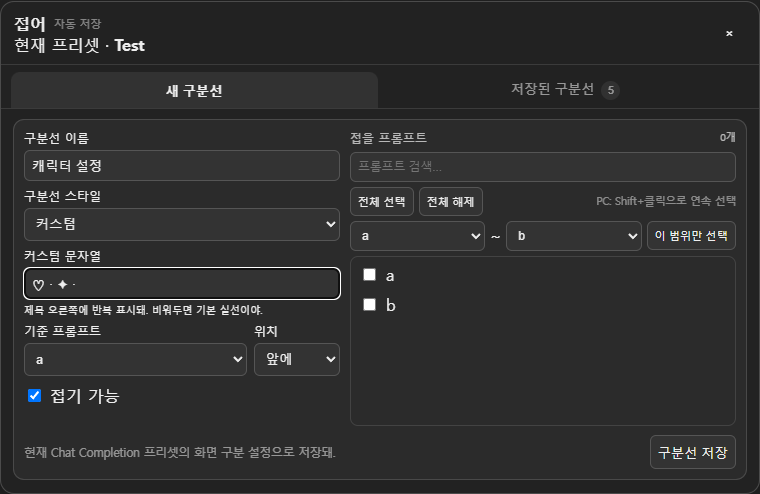
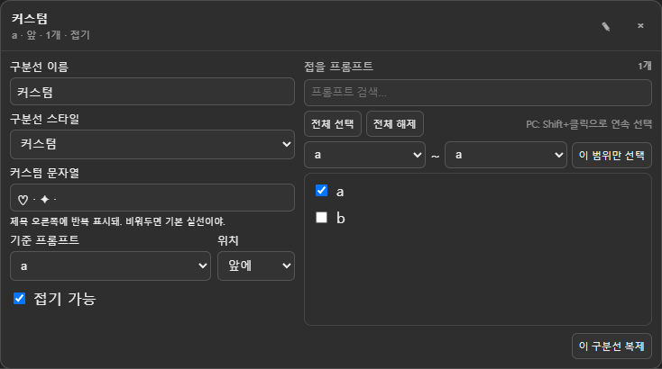

# 접어 · Prompt Organizer

**프롬프트가 많아졌다면, 구분선을 넣고 필요한 묶음만 접어두세요.**

SillyTavern의 Chat Completion Prompt Manager를 정리하는 확장입니다.
화면에서 접어도 프롬프트는 모델에 그대로 전달됩니다. 실제 내용·순서·ON/OFF·Role·Depth는 바뀌지 않습니다.



> 이미지 안내: 확장의 실제 UI 코드를 테스트용 프롬프트로 실행한 예시 화면입니다. SillyTavern 전체 화면은 아니며, 테마·글꼴에 따라 모양이 달라질 수 있습니다.

[설치](#설치) · [새 구분선](#새-구분선-만들기) · [스타일 꾸미기](#구분선-꾸미기) · [수정과 복사](#저장한-구분선-관리) · [아이콘 숨기기](#채팅-아이콘만-숨기기)

## 설치

1. SillyTavern의 **확장 설치** 화면을 엽니다.
2. 아래 주소를 입력해 설치합니다.
3. SillyTavern을 **새로고침**합니다. 기존 사용자는 확장 업데이트 후 새로고침하세요.

```text
https://github.com/bongbong11/Prompt_Organizer
```

## 접어 열기


- 채팅 입력창 옆 **종이접기 아이콘**을 누르거나,
- **마법봉 / Extensions → 접어**를 선택하세요.

상단에 표시된 이름이 현재 프리셋입니다. SillyTavern에서 선택한 Chat Completion 프리셋을 자동으로 따라가며, 구분선은 **프리셋별로 따로 저장**됩니다.

## 새 구분선 만들기



1. **새 구분선** 탭에서 이름을 입력합니다. 예: `캐릭터 설정`, `문체`, `세계관`.
2. **구분선 스타일**을 고릅니다. 처음에는 기본 실선을 써도 됩니다.
3. **기준 프롬프트**와 그 **앞 / 뒤** 중 위치를 고릅니다.
4. 묶음을 접고 싶다면 **접기 가능**을 켜고, 오른쪽에서 접을 프롬프트를 선택합니다.
5. **구분선 저장**을 누릅니다.

저장 후에는 **저장된 구분선** 탭으로 이동합니다.
Prompt Manager에서 구분선 왼쪽 화살표를 누르면 선택한 프롬프트만 접히고, 다시 누르면 펼쳐집니다.
**접기 가능**을 끄면 장식용 구분선으로 사용할 수 있습니다.

## 구분선 꾸미기

제목 오른쪽의 모양을 구분선마다 다르게 고를 수 있습니다.

| 스타일 | 모양 |
| --- | --- |
| **기본 실선** | 기존의 얇고 긴 선 |
| **점점점** | `· · · · ·` |
| **물결** | `〜〜〜〜〜` |
| **꾸밈선** | `─ ✦ ─ ✦ ─ ✦` |
| **커스텀** | 내가 입력한 문자열 반복 |

**커스텀**을 선택하면 입력칸이 나타납니다. 아래처럼 자유롭게 입력해보세요.

```text
♡ · ✦ ·
🌸
✧･ﾟ
═╪═
```

- 입력한 문자열이 **제목 오른쪽의 남은 공간에 반복**됩니다.
- 길면 영역 끝에서 잘려 표시됩니다. 빈칸이나 공백만 넣으면 **기본 실선**으로 돌아갑니다.
- 다른 스타일로 바꿔도 커스텀 입력값은 보관됩니다.
- HTML처럼 생긴 문자열도 코드로 실행되지 않고 글자로 표시됩니다.

## 프롬프트 빠르게 고르기

새 구분선을 만들 때와 저장한 구분선을 수정할 때 모두 사용할 수 있습니다.

| 하고 싶은 일 | 사용 방법 |
| --- | --- |
| 이름으로 찾기 | **프롬프트 검색…**에 이름 일부 입력 |
| 보이는 항목 모두 선택 | **전체 선택** — 검색 중이면 검색 결과만 선택 |
| 선택 모두 지우기 | **전체 해제** — 검색으로 숨겨진 항목도 해제 |
| PC에서 연속 선택 | 첫 항목 클릭 → **Shift + 마지막 항목 클릭** |
| 모바일에서 긴 구간 선택 | **시작 ~ 끝** 지정 → **이 범위만 선택** |

**이 범위만 선택**은 양 끝을 포함하고, 범위 밖의 기존 선택은 해제합니다.
Shift + 클릭은 두 항목 사이를 마지막으로 클릭한 체크 상태에 맞춥니다.

## 저장한 구분선 관리

**저장된 구분선 → 이름 또는 연필 아이콘**을 누르면 수정 화면이 열립니다.



이름·스타일·커스텀 문자열·기준 프롬프트·앞/뒤 위치·접기 여부·접을 목록을 수정할 수 있습니다.
**변경 즉시 자동 저장**되므로 저장 버튼을 다시 누를 필요가 없습니다.

| 기능 | 사용 방법 |
| --- | --- |
| 복제 | 편집 영역 아래 **이 구분선 복제**. 이름에 `복사본`이 붙고 펼쳐진 상태로 생성 |
| 삭제 | **휴지통 아이콘** → 확인. 실제 프롬프트는 삭제되지 않음 |
| 한꺼번에 접기 | 탭 상단 **모두 접기**. 접기 가능한 구분선에 적용 |
| 한꺼번에 펼치기 | 탭 상단 **모두 펼치기** |
| 다른 프리셋으로 복사 | **다른 프리셋으로 복사** → 대상 프리셋 이름을 정확히 입력 |

복제와 프리셋 복사에는 **스타일과 커스텀 문자열도 포함**됩니다.
대상 프리셋에 구분선이 있으면 덮어쓰기 확인이 나옵니다. 복사된 구분선은 펼쳐진 상태로 시작합니다.
이 기능은 접어 설정만 복사하며 실제 프리셋 내용은 복사하지 않습니다.

## 채팅 아이콘만 숨기기

**확장 설정 → 접어**에서 **확장 사용** 아래의 **채팅 입력창 아이콘 표시**를 끄세요.


구분선과 접기 기능은 계속 작동하며, 관리 창은 **마법봉 / Extensions → 접어**로 열 수 있습니다.
다시 켜면 채팅 입력창의 종이접기 아이콘이 돌아옵니다.

아이콘 표시 여부는 새로고침하거나 확장을 껐다 켜도 유지됩니다.
신규 설치와 기존 버전 업데이트의 기본값은 **켜짐**입니다.

## 확장 전체 끄기

**확장 설정 → 접어 → 확장 사용**을 끄세요.

구분선과 두 곳의 실행 아이콘이 사라지고, 접혀 있던 프롬프트가 다시 보입니다.
저장된 설정은 남아 있으므로 다시 켜면 복원됩니다. 채팅 아이콘은 별도로 선택한 표시 설정을 따릅니다.

## 알아두면 좋은 점

- **프리셋을 바꾸면** 열린 관리 창이 닫히고 새 프리셋의 구분선이 적용됩니다.
- **접힌 상태도 저장**되며 Prompt Manager가 다시 그려져도 유지됩니다.
- **기존 사용자는 다시 만들 필요가 없습니다.** 기존 구분선은 기본 실선으로 유지됩니다.
- **모바일에서도** 검색·범위 선택·수정 기능을 사용할 수 있습니다.

<details>
<summary><strong>저장 데이터와 안전 범위 자세히 보기</strong></summary>

설정은 `extensionSettings.promptOrganizer`에만 저장합니다.

- 확장 사용 여부, 채팅 아이콘 표시 여부(`showChatIcon`)
- 프리셋별 구분선 이름·위치·접을 프롬프트 ID
- 접기 가능 여부와 접힘 상태
- 구분선 스타일(`lineStyle`)과 커스텀 문자열(`customLine`)

설정 버전 11로 자동 이전합니다. 빠진 아이콘 설정은 `true`, 스타일은 `solid`, 커스텀 문자열은 빈 문자열로 채웁니다.
기존 위치·멤버·접힘 상태와 이미 저장된 새 설정은 유지합니다.

**변경하지 않는 데이터:** 실제 프롬프트 내용·순서·Role·Depth·Order/Position·ON/OFF,
프리셋 내용과 저장 파일, 생성 직전 API 전송 배열, 모델에 전달되는 메시지 구조.

접어는 화면에 구분선을 추가하고 지정한 행을 숨기거나 표시하는 UI 전용 확장입니다.

</details>

아이콘: [Lucide Origami](https://lucide.dev/icons/origami), ISC License. [라이선스 전문](docs/LUCIDE-LICENSE.txt).

<details>
<summary><strong>개발용 검증 방법</strong></summary>

JavaScript 문법: `node --check index.js`

브라우저 검증: Playwright와 Microsoft Edge가 설치된 환경에서 `node tests/render.cjs`.
기존 설정 이전, 아이콘 독립 제어, 생성·수정·복제·프리셋 복사, 문자열 안전 표시와 빈칸 폴백,
데스크톱·모바일 화면 너비를 확인합니다. 테스트용 Prompt Manager를 사용하므로 실제 SillyTavern 통합 검증을 대체하지는 않습니다.

</details>
